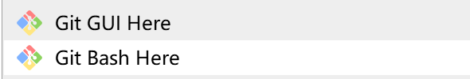

# Examination

本仓库为期末考试知识整理所用。

现有计量经济学、有限维优化、计算机预测三个板块。


**git 相关基础操作**

**第一次使用**

Step 1: 将本仓库下载至本地

在准备存放仓库的本地磁盘中，右键选择Git Bash Here (该操作首先要下载Git)



在弹出的命令框中输入

```cmd
git clone https://github.com/AlanWilliamStark/Examnation.git
```

此时，你的磁盘上会新增一个名为 Examination 的文件夹

Step 2：上传文件

进入Examination 文件夹对文件进行编辑，扩充。

操作完成后，在Examination文件夹中，右键选择Git Bash Here

在弹出的命令框中依次输入：

```cmd
git add .

git commit -m "提交说明" #此处的提交说明请写你名字的首字母并描述修改内容，如：ywf，新增第3题。

git branch -M ywf #将这里的ywf改为你名字的首字母

git push origin ywf #这一步将本地修改同步至github远程仓库。同样，请将ywf改为你名字的首字母
```

以上是第一次使用时的操作。

**非首次上传**

第一次使用时需要为自己建立分支branch，非首次上传，就可以省去这个步骤。

所以执行以下步骤即可：

```cmd
git add .

git commit -m "提交说明" #此处的提交说明请写你名字的首字母并描述修改内容，如：ywf，新增第3题。

git push origin ywf #这一步将本地修改同步至github远程仓库。同样，请将ywf改为你名字的首字母
```

**本地仓库同步至远程仓库**

```cmd
git remote -v #查看远程仓库
git fetch origin main #把远程仓库更新到本地
git merge origin/main #合并本地与远程仓库
```

**至此，我们就可以使用以上的方法，实现简单的协同开发。大家可以通过简单的指令，实现向远程仓库上传成果和将大家共同的成果同步到本地。除去了微信互发文件的繁琐，将效率拉满。**


**祝大家考试顺利!**

